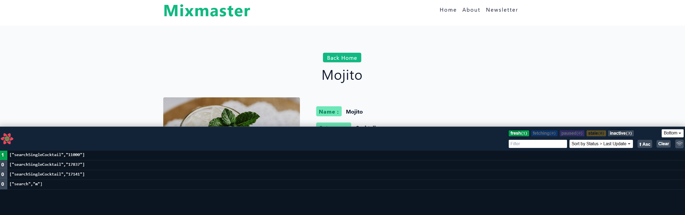

# React Training by John Smilga
React Training by John Smilga (Udemy)
- Main Benefits
- Independence
- Reusability
- Speed

- npm helps us to install external packages

# Difference between npm and npx

- npm (Node Package Manager) and npx (Node Package Execute) are both tools that come with Node.js, but they serve different purposes.

- npm: It's mainly used for managing packages and dependencies. You use it to install, update, and uninstall packages or libraries in your project. Example: npm install express installs the Express library for your project.

- npx: It's designed to execute binaries from npm packages. You can use it to run commands without globally installing the package. Example: npx create-react-app my-app runs the create-react-app command to set up a new React application without needing to install create-react-app globally. In essence, npm is your go-to for managing packages, while npx is your tool for running package binaries directly.

- Entire React Application lives in here

```html
<div id = "root"></div>
```

- package.json contains dependencies and scripts
- package-lock.json --> It is a snapshot of our entire dependency tree
- It ensures that everyone working on the project installs exactly the same versions of the dependencies, regardless of when they run npm install.

- Create root element and render everything inside the root

```js
import React from 'react'
import ReactDOM from 'react-dom/client'

function Greeting() {
    return <h2>My First Component</h2>
}

const root = ReactDOM.createRoot(document.getElementById('root'));

root.render(<Greeting />);
```

- Above code is all JSX
- JSX is easier, otherwise we will have to use React Element like this:

```js

function Greeting() {
     return React.createElement('h2',{},'hello world')
 }
function Greeting() {
    return React.createElement('div',{},React.createElement('h2',{},'hello world'))
}

```
- If we put our assets(images) in public folder they get optimized(similar to wwwroot)
# JSX - CSS (inline styles)
- style prop
- {} in JSX means going back to JS Land
- value is an object with key/value pairs - capitalized and with ''

```js
const Author = () => (
  <h4 style={{ color: '#617d98', fontSize: '0.75rem', marginTop: '0.5rem' }}>
    Jordan Moore
  </h4>
);
```

- Alternative Option
```js
const Author = () => {
  const inlineHeadingStyles = {
    color: '#617d98',
    fontSize: '0.75rem',
    marginTop: '0.5rem',
  };
  return <h4 style={inlineHeadingStyles}>Jordan Moore </h4>;
};

```
- In Inline styles general CSS rules apply. 
- Inline Style always override CSS file styles

# Children Prop
- everything we render between component tags
- during the course we will mostly use it Context API
- special prop, has to be "children"
- can place anywhere in JSX

```js
function BookList() {
  return (
    <section className='booklist'>
      <Book
        author={firstBook.author}
        title={firstBook.title}
        img={firstBook.img}
      >
        <p>
          Lorem ipsum dolor, sit amet consectetur adipisicing elit. Itaque
          repudiandae inventore eos qui animi sed iusto alias eius ea sapiente.
        </p>
        <button>click me</button>
      </Book>
      <Book
        author={secondBook.author}
        title={secondBook.title}
        img={secondBook.img}
      />
    </section>
  );
}

const Book = ({ img, title, author, children }) => {
  // rest of the logic
};
const Book = (props) => {
  const { img, title, author, children } = props;
  console.log(props);
  return (
    <article className='book'>
      
      <h2>{title}</h2>
      <h4>{author} </h4>
      {children}
    </article>
  );
};
```

# Key Prop
- The key prop in React is crucial for keeping your UI efficient and consistent. 
- When rendering lists of elements, the key helps React identify which items have changed, been added, or removed. 
- Without it, React would have to re-render the entire list every time something changes, which is not efficient.

```js
const items = ['Apple', 'Banana', 'Cherry'];

const listItems = items.map((item, index) => 
  <li key={index}>{item}</li>
);

return <ul>{listItems}</ul>;


```
- Each list item has a unique key prop, which helps React update the list efficiently.
- Using indexes as keys can be a quick solution, but for more dynamic lists, unique identifiers are better to avoid bugs.

# For copying objects use the spread operator

```js
const friends = ['john', 'peter', 'anna'];
const newFriends = [...friends, 'susan'];
console.log(friends);
console.log(newFriends);
const someObject = {
  name: 'john',
  job: 'developer',
};
// COPY NOT A REFERENCE !!!!
const newObject = { ...someObject, location: 'florida' };
console.log(someObject);
console.log(newObject);

```

- Pass Data with help of spread operator:

```js
function BookList() {
  return (
    <section className='booklist'>
      {books.map((book) => {
        return <Book  {...book} key={book.id} />;
      })}
    </section>
  );
}

const Book = (props) => {
  const { img, title, author } = props;
  return (
    <article className='book'>
      
      <h2>{title}</h2>
      <h4>{author} </h4>
    </article>
  );
};
const Book = ({ img, title, author }) => {
  // rest of the code
};

```

# Why do we do {()=>handleClick} instead of {handleClick}
- This is a javascript feature {handleClick} is immediately invoked, but when we use anonymous function syntax it is invoked on the basis of an event like button click
- Using {()=>handleClick} creates an anonymous function that calls handleClick, ensuring the function isn't invoked immediately during rendering. 
- It passes a new function reference each time, which can cause unnecessary re-renders.
- On the other hand, {handleClick} directly passes the function reference, calling it on the event, which is more efficient if the function doesn't require arguments or context.
- Basically: {()=>handleClick} = safe but might re-render more, {handleClick} = efficient but use cautiously.

### Import and Export Modules(ES6 Modules) help to organize our application

### React optimizes images stored in the src folder

***rem stands for "root em" and is a unit in CSS used for sizing elements relative to the root element's font size. Unlike em, which is relative to the font size of its parent element, rem is always relative to the root <html> element.***

```js
html {
  font-size: 16px; /* Default root font size */
}

body {
  font-size: 1rem; /* 16px */
}

h1 {
  font-size: 2rem; /* 32px */
}


```
- rem ensures consistency through our project

## npm run build builds a production ready application

# Vite is faster than Create-React-App
- has hot module refresh and provides a better developer experience

# Initial Render and Re-Renders
- In a React application, the initial render is the first time that the component tree is rendered to the DOM. 
- It happens when the application first loads, or when the root component is first rendered. This is also known as "mounting" the components.
- Re-renders, on the other hand, happen when the component's state or props change, and the component needs to be updated in the DOM to reflect these changes. 
- React uses a virtual DOM to optimize the process of updating the actual DOM, so that only the necessary changes are made.
- There are a few ways that you can trigger a re-render in a React component:

- By changing the component's state or props. When the component's state or props change, React will re-render the component to reflect these changes.

- When the parent element re-renders, even if the component's state or props have not changed.

# General Rules of Hooks
- starts with "use" (both -react and custom hooks)
- component must be uppercase
- invoke inside function/component body
- don't call hooks conditionally 
- set functions don't update state immediately 

# In useState() if we generate a new state, then we trigger a re-render

# Automatic Batching

- In React, "batching" refers to the process of grouping multiple state updates into a single update. This can be useful in certain cases because it allows React to optimize the rendering of your components by minimizing the number of DOM updates that it has to perform.

- By default, React uses a technique called "auto-batching" to group state updates that occur within the same event loop into a single update. This means that if you call the state update function multiple times in a short period of time, React will only perform a single re-render for all of the updates.

- React 18 ensures that state updates invoked from any location will be batched by default. This will batch state updates, including native event handlers, asynchronous operations, timeouts, and intervals.
  
- Keep in mind that the state update function setState does not immediately mutate the state. 
- Instead, it schedules an update to the state and tells React that it needs to re-render the component. The actual state update will be performed as part of the next rendering cycle.
-  Be mindful when you need to set state value based on a different state value.
  
# useState hook

## State doesnot update immediately after calling setFunction
- Keep in mind that the state update function setState does not immediately mutate the state. Instead, it schedules an update to the state and tells React that it needs to re-render the component. The actual state update will be performed as part of the next rendering cycle.

- If you want to update the state immediately and synchronously, you can pass a function to setState that receives the previous state as an argument and returns the new state. 
 ### To update the state synchronously we can do it like this:

 ```js
const handleClick = () => {
  setValue((currentState) => {
    // must return otherwise undefined
    // below is the latest/current state value
    const newState = currentState + 1;
    return newState;
  });
};

 ```

 **In Javascript functions by default return undefined**

 # useEffect hook

 - useEffect is a hook in React that allows you to perform side effects in function components.
 - There is no need for urban dictionary - basically any work outside of the component. 
 - Some examples of side effects are: subscriptions, fetching data, directly updating the DOM, event listeners, timers, etc.

- useEffect hook
- accepts two arguments (second optional)
- first argument - cb function
- second argument - dependency array
- by default runs on each render (initial and re-render)
- cb can't return promise (so can't make it async)
- if dependency array empty [] runs only on initial render

## Inside the useEffect we need to cleanup components also

```js
import { useEffect, useState } from 'react';

const CleanupFunction = () => {
  const [toggle, setToggle] = useState(false);
  return (
    <div>
      <button className='btn' onClick={() => setToggle(!toggle)}>
        toggle component
      </button>
      {toggle && <RandomComponent />}
    </div>
  );
};
const RandomComponent = () => {
  useEffect(() => {
    // console.log('hmm, this is interesting');
    const intID = setInterval(() => {
      console.log('hello from interval');
    }, 1000);
    // does not stop, keeps going
    // every time we render component new interval gets created
    return () => clearInterval(intID);
  }, []);
  return <h1>hello there</h1>;
};
export default CleanupFunction;

```

# Why use Axios instead of Fetch API

- Unlike for example Axios, by default, the fetch() API does not consider HTTP status codes in the 4xx or 5xx range to be errors. Instead, it considers these status codes to be indicative of a successful request. So for fetch API we have the do the following:

```js
try {
const resp = await fetch(url);
// console.log(resp);
if (!resp.ok) {
  setIsError(true);
  setIsLoading(false);
  return;
}

const user = await resp.json();
setUser(user);

}

```
# Truthy and Falsy Values in Javascript

- In JavaScript, a value is considered "truthy" if it is evaluated to true when used in a boolean context. A value is considered "falsy" if it is evaluated to false when used in a boolean context.

- Here is a list of values that are considered falsy in JavaScript:

- false 0 (zero)
-  "" (empty string) 
-  null 
-  undefined 
-  NaN (Not a Number) 
  
All other values, including objects and arrays, are considered truthy.

```js
const x = 'Hello';
const y = '';
const z = 0;

if (x) {
  console.log('x is truthy');
}

if (y) {
  console.log('y is truthy');
} else {
  console.log('y is falsy');
}

if (z) {
  console.log('z is truthy');
} else {
  console.log('z is falsy');
}

// Output:
// "x is truthy"
// "y is falsy"
// "z is falsy"

```
- In this example, the variable x is a non-empty string, which is considered truthy, so the first if statement is executed. 
- The variable y is an empty string, which is considered falsy, so the else block of the second if statement is executed. 
- The variable z is the number 0, which is considered falsy, so the else block of the third if statement is executed.

# Short Circuit Evaluation

- In JavaScript, short-circuit evaluation is a technique that allows you to use logical operators (such as && and ||) to perform conditional evaluations in a concise way.

- The && operator (logical AND) returns the first operand if it is "falsy", or the second operand if the first operand is "truthy".

```js
const x = 0;
const y = 1;

console.log(x && y); // Output: 0 (the first operand is falsy, so it is returned)
console.log(y && x); // Output: 0 (the second operand is falsy, so it is returned)
```
- The || operator (logical OR) returns the first operand if it is "truthy", or the second operand if the first operand is "falsy".

```js
const x = 0;
const y = 1;

console.log(x || y); // Output: 1 (the first operand is falsy, so the second operand is returned)
console.log(y || x); // Output: 1 (the first operand is truthy, so it is returned)

```
- Short-circuit evaluation can be useful in cases where you want to perform a certain action only if a certain condition is met, or you want to return a default value if a certain condition is not met.

```js
function displayName(name) {
  return name || 'Anonymous';
}

console.log(displayName('Pizza')); // Output: "Pizza"
console.log(displayName()); // Output: "Anonymous"
```
# Remember if the parent component re-renders, it forces the child components to re-render as well

## You may not need an Effect
- They are an escape hatch from React paradigm(DOM manipulation)
- Dont use too many useEffects(can cause network waterfalls)
- For Data Fetching use framework's setup or React Query

# Project Structure
- Associate each component with a folder.This will ensure all the files related to that component(including any CSS files) are within that component folder
- One way to set it up is to export the component like this
```js
import React from 'react'

function Navbar() {
  return <div>Navbar component</div>
}

export default Navbar


```

and then we create a new index.jsx file and export it like this:

```js
export {default} from './Navbar'
```

## Another way to create a pages folder and have all the components under it

- Create an index.jsx to import first and then export all the components like this:

```js
import Home from './Home'
import About from './About'

export { Home, About }

```

- Then we can use them like this
  
```js
import { Home, About } from './tutorial/04-project-structure/starter/Pages/'
function App() {
  return (
    <div className="container">
      <h2>Advanced React</h2>
      <Home />
      <About />
    </div>
  )
}
```

# FormData API
- Comes from Vanilla JS
- a great solution when you have bunch of inputs
- inputs must have name attribute
- Can be used to submit form inputs even if they are uncontrolled
The FormData interface provides a way to construct a set of key/value pairs representing form fields and their values, which can be sent using the fetch() or XMLHttpRequest.send() method. It uses the same format a form would use if the encoding type were set to "multipart/form-data".

```js
import { useState } from 'react';

const UncontrolledInputs = () => {
  const [value, setValue] = useState(0);

  const handleSubmit = (e) => {
    e.preventDefault();

    const formData = new FormData(e.currentTarget);
    // const name = formData.get('name');
    // console.log(name);
    // console.log([...formData.entries()]);
    const newUser = Object.fromEntries(formData);
    // do something (post request, add to list, etc)
    console.log(newUser);
    // Gotcha - re-render won't clear out the values
    setValue(value + 1);
    // reset values
    e.currentTarget.reset();
  };
  return (
    <div>
      <form className='form' onSubmit={handleSubmit}>
        <h4>Form Data API</h4>
        {/* name */}
        <div className='form-row'>
          <label htmlFor='name' className='form-label'>
            name
          </label>
          <input type='text' className='form-input' id='name' name='name' />
        </div>
        {/* email */}
        <div className='form-row'>
          <label htmlFor='email' className='form-label'>
            Email
          </label>
          <input type='email' className='form-input' id='email' name='email' />
        </div>
        {/* password */}
        <div className='form-row'>
          <label htmlFor='password' className='form-label'>
            Password
          </label>
          <input
            type='password'
            className='form-input'
            id='password'
            name='password'
          />
        </div>

        <button type='submit' className='btn btn-block'>
          submit
        </button>
      </form>
    </div>
  );
};
export default UncontrolledInputs;

```
- e.currentTarget
In React, e.currentTarget returns the DOM element that triggered the event.

- Object From Entries
The Object.fromEntries() static method transforms a list of key-value pairs into an object.

```js
const entries = new Map([
  ['foo', 'bar'],
  ['baz', 42],
]);

const obj = Object.fromEntries(entries);

console.log(obj);
// Expected output: Object { foo: "bar", baz: 42 }

```

- reset()
The reset() method is a built-in method in HTML that can be used to reset all form controls to their initial values. When this method is called on a form element, it will clear any user-entered data and reset the values of all form elements to their default values.

# useRef

- DOES NOT TRIGGER RE-RENDER
- preserves the value between renders
- target DOM nodes/elements
- Used for uncontrolled inputs to access the DOM elements

```js
const refContainer = useRef(null)

  const handleSubmit = (e) => {
    e.preventDefault()
    console.log(value)
    const name = refContainer.current.value
    console.log(name)
  }

```

# Custom Hooks
- same rules as regular hooks
- simplify component (less code)
- re-use functionality

```js
export const useToggle = (defaultValue) => {
  const [show, setShow] = useState(defaultValue)
  const toggle = () => {
    setShow(!show)
  }
  return { show, toggle }
}

const ToggleExample = () => {
  //Call the custom hook
  const { show, toggle } = useToggle(false)
  return (
    <div>
      <h4>toggle custom hook</h4>
      <button className="btn" onClick={() => toggle()}>
        toggle
      </button>
      {show && <h4>some stuff</h4>}
    </div>
  )
}
export default ToggleExample
```

# useContext

- useContext is a hook in React that allows you to access and share context values across your component tree without passing props down manually at every level. 
- It's perfect for sharing global state, themes, or authentication data.

## Create Context

```js
import React, { createContext, useContext } from 'react';

const ThemeContext = createContext();

```

## Provide Context
```js
function App() {
  const theme = { background: 'black', color: 'white' };

  return (
    <ThemeContext.Provider value={theme}>
      <Toolbar />
    </ThemeContext.Provider>
  );
}


```

## useContext

```js
function Toolbar() {
  const theme = useContext(ThemeContext);

  return (
    <div style={{ background: theme.background, color: theme.color }}>
      Toolbar
    </div>
  );
}


```

## Custom Hook for accessing the context

```js
//Create Context
export const NavbarContext = createContext()

//Custom hook to access the Navbar Context
export const useAppContext = () => useContext(NavbarContext)

//Consume the custom hook to access the context
  const { user, logout } = useAppContext()
```

# useReducer
- light version of Redux
- less bugs and easier code management
- redux has boilerplate code
- So React released useReducer hook
- This hook is middle ground between redux and useState hook
- Reducer is a function that manipulates the state
- useReducer is a hook in React that's perfect for managing state with more complex logic, especially when state transitions depend on previous states. 
- It’s like a more powerful version of useState.

```js
const [state, dispatch] = useReducer(reducer, defaultState)
const CLEAR_LIST = 'CLEAR_LIST'
const RESET_LIST = 'RESET_LIST'
const REMOVE_ITEM = 'REMOVE_ITEM'

const defaultState = {
  people: data,
}
const reducer = (state, action) => {
  switch (action.type) {
    case CLEAR_LIST:
      return { ...state, people: [] }
    case RESET_LIST:
      return { ...state, people: data }
    case REMOVE_ITEM:
      return {
        ...state,
        people: state.people.filter((x) => x.id != action.payload),
      }
    default: throw new Error(`No matching "${action.type}" -action type`)
  }
}

const removeItem = (id) => {
    dispatch({ type: REMOVE_ITEM, payload: id })
  }

const reset = () => {
    dispatch({ type: RESET_LIST })
  }

  {state.people.map((person) => {
        const { id, name } = person
        return (
          <div key={id} className="item">
            <h4>{name}</h4>
            <button onClick={() => removeItem(id)}>remove</button>
          </div>
        )
      })}
```

# Improving Performance of React Applications

## When does a Component Re-Render ? :

- When the component's state or props change, React will re-render the component to reflect these changes.
- When the parent element re-renders, even if the component's state or props have not changed.
- lower state

### First Possible Solution: Lower the State
- Create a new component and move useState to that component
- This basically involves breaking down your components and splitting the logic(Code-splitting)
- Move the code that is triggering state changes into a separate component with its own component

### React.memo()
- React.memo is a higher-order component (HOC) in React that allows you to memoize a component. 
- This means that if the input props to the component have not changed, the memoized component will return the same result from the previous render, instead of re-rendering. 
- This can help improve performance by avoiding unnecessary render cycles.
- The React.memo function takes a functional component as its argument and returns a new component that has the same behavior, but with the added optimization of checking if the props have changed.
-  If the props have not changed, the memoized component will return the cached result from the previous render.
  
```js
const MyComponent = React.memo(function MyComponent(props) {
  /* render logic */
});
```


```js
import { memo } from 'react'
import Item from './Person'

const List = ({ people }) => {
  return (
    <div>
      {people.map((person) => {
        return <Item key={person.id} {...person} />
      })}
    </div>
  )
}
export default memo(List)


```

### useCallback 

- The useCallback hook is a hook in React that allows you to memoize a function. 
-  It takes two arguments: the first is the function you want to memoize, and the second is an array of dependencies. 
-  The hook will return a memoized version of the function that only changes if one of the values in the dependency array changes.
-  By memoizing the function, you can avoid unnecessary re-renders and improve the performance of your React application. 
-  The function will only be re-created if one of its dependencies changes, otherwise the same instance of the function will be returned. 
-  This can be useful in situations where you have an expensive function that you only want to recompute when its dependencies change.

```js
import React, { useCallback, useState } from 'react';

function MyComponent() {
  const [data, setData] = useState([]);
  const handleClick = useCallback(() => {
    console.log(data);
  }, [data]);

  return (
    <div>
      <button onClick={handleClick}>Click me</button>
    </div>
  );
}

```
- In this example, the handleClick function is memoized using useCallback and the data prop is passed as a dependency. 
- This means that the handleClick function will only be re-created if the data prop changes.

### useMemo
- The useMemo hook is a hook in React that allows you to memoize a value.
- It takes two arguments: the first is a function that returns the value you want to memoize, and the second is an array of dependencies. 
- The hook will return the memoized value that will only change if one of the values in the dependency array changes.
- By memoizing a value, you can avoid unnecessary calculations and improve the performance of your React application. 
- . The value will only be recalculated if one of its dependencies changes, otherwise the same instance of the value will be returned.
- This can be useful in situations where you have an expensive calculation that you only want to recompute when its dependencies change.

```js
import React, { useMemo } from 'react';

function MyComponent({ data }) {
  const processedData = useMemo(() => {
    return data.map((item) => item.toUpperCase());
  }, [data]);

  return (
    <div>
      {processedData.map((item) => (
        <div key={item}>{item}</div>
      ))}
    </div>
  );
}

```
- In this example, the processedData value is memoized using useMemo and the data prop is passed as a dependency.
- This means that the processedData value will only be recalculated if the data prop changes.

### useTransition Hook
- Available from React 18
- useTransition is a React Hook that lets you update the state without blocking the UI.
-  It’s particularly useful when you want to keep the UI responsive during state updates that might take a bit longer, like filtering a large list.
-  For e.g user types something in input and we have to filter some 20000 items(expensive computation). This can make our app un-responsive, so we can use useTransition hook here.
-  Has very specific use-cases

```js
import React, { useState, useTransition } from 'react';

function FilterableList({ items }) {
  const [filter, setFilter] = useState('');
  const [isPending, startTransition] = useTransition();
  const [filteredItems, setFilteredItems] = useState(items);

  const handleChange = (event) => {
    const value = event.target.value;
    setFilter(value);

  // slow function goes in start transition
    startTransition(() => {
      const filtered = items.filter(item => item.includes(value));
      setFilteredItems(filtered);
    });
  };

  return (
    <div>
      <input type="text" value={filter} onChange={handleChange} />
      {isPending ? <p>Loading...</p> : <ul>{filteredItems.map((item, index) => <li key={index}>{item}</li>)}</ul>}
    </div>
  );
}

```

- useTransition returns isPending (a boolean indicating if the transition is pending) and startTransition (a function to start the transition).
- When the input value changes, the startTransition function updates the filtered items without blocking the input field's responsiveness.
- The UI shows a loading message while the transition is in progress.
- This hook can make your app feel snappier by deferring updates that aren't immediately visible to the user, keeping interactions smooth.


### React Suspense
- The Suspense API is a feature in React that allows you to manage the loading state of your components. 
- It provides a way to "suspend" rendering of a component until some data has been fetched, and display a fallback UI in the meantime.
- This makes it easier to handle asynchronous data loading and provide a smooth user experience in your React application.

```js
import React, { lazy, Suspense } from 'react';

const DataComponent = lazy(() => import('./DataComponent'));

function MyComponent() {
  return (
    <Suspense fallback={<div>Loading...</div>}>
      <DataComponent />
    </Suspense>
  );
}

```

# Axios Http Library
- Fetching Data from and Sending Data to Server
- HTTP Library used for data fetching
- Not part of React
- Can be used with any framework
- Popular for Data Fetching
- Axios makes handling HTTP requests super straightforward and integrates seamlessly with React.
- Axios is a popular HTTP client for making requests in JavaScript, and it works great with React. Here's a quick guide to using axios in a React application:

```js
import React, { useState, useEffect } from 'react';
import axios from 'axios';

function DataFetchingComponent() {
  const [data, setData] = useState([]);
  const [loading, setLoading] = useState(true);
  const [error, setError] = useState(null);

  useEffect(() => {
    axios.get('https://api.example.com/data')
      .then(response => {
        setData(response.data);
        setLoading(false);
      })
      .catch(error => {
        setError(error);
        setLoading(false);
      });
  }, []);

  if (loading) return <p>Loading...</p>;
  if (error) return <p>Error: {error.message}</p>;

  return (
    <ul>
      {data.map(item => (
        <li key={item.id}>{item.name}</li>
      ))}
    </ul>
  );
}

export default DataFetchingComponent;


```

- default get axios(url)
- returns a promise
- response data located in data property
- error in error.response
- axios.get(url)
- axios.post(url)
- axios.patch/put(url)
- axios.delete(url)

## Axios Headers
- Axios Headers are usually the second argument in an axios request
- axios.get(url,{})
- However in requests with data it is usually the third argument
- axios.post(url,{data},{})

```js
const fetchDadJoke = async () => {
    try {
      const response = await axios(url,{headers:{
        Accept:'application/json'
      }});
      console.log(response.data)
      setJoke(response.data.joke)
    } catch (error) {
      console.log(error.response)
    }
    
  };

```

## Axios Post Request
- send data to the server
- axios.post(url, { data })
- more options (auth header) - axios.post(url, { data },{})

```js
const handleSubmit = async (e) => {
    e.preventDefault();
    try {
      const response = await axios.post(url,{name:name,email:email},{headers:{
        Accept:'application/json'
      }})
      console.log(response.data)
      setMessage(response.data.msg)
    } catch (error) {
      console.log(error.response)
    }
   
  };
```

## Setting Global Defaults
- Cant be setting the header to application/json all the time
- So we can use global defaults property of axios
- Setting global defaults in Axios makes configuring your requests consistent and easy.
- The below technique sets global defaults that apply to all Axios requests.

```js
import axios from 'axios';

// Set defaults directly on the Axios instance
axios.defaults.baseURL = 'https://api.example.com';
//Returns undefined in latest axios versions
axios.defaults.headers.common['Authorization'] = 'Bearer your_token';
axios.defaults.timeout = 1000;
// In latest axios version common property returns "undefined"
// axios.defaults.headers.common['Accept'] = 'application/json';
axios.defaults.headers['Accept'] = 'application/json';

axios.defaults.baseURL = 'https://api.example.com';

// In latest axios version common property returns "undefined"
// axios.defaults.headers.common['Authorization'] = AUTH_TOKEN;
axios.defaults.headers['Authorization'] = AUTH_TOKEN;

axios.defaults.headers.post['Content-Type'] =
  'application/x-www-form-urlencoded';

```
- **Global Instance may not be suitable for all scenarios. We may need a custom axios instance also**
- We can also setup a custom axios instance and configure these properties for that instance only

```js
import axios from 'axios';

const instance = axios.create({
  baseURL: 'https://api.example.com',
  timeout: 1000,
  headers: { 'Authorization': 'Bearer your_token' }
});

export default instance;


import axios from 'axios';
import authFetch from './custom';
const CustomInstance = () => {
  const fetchData = async () => {
    try {
      const resp1 = await authFetch('/react-store-products');
      const resp2 = await axios(randomUserUrl);
    } catch (error) {
      console.log(error.response)
    }
  };

  useEffect(() => {
    fetchData();
  }, []);

  return <h2 className='text-center'>custom instance</h2>;
};

```

## Interceptors
- These are functions that axios calls for every request
- Can be used to transform the request before it leaves the application
- Can add custom logic to the response
- Interceptors in Axios are like middleware for your HTTP requests and responses. 
- They allow you to modify requests before they are sent and responses before they are handled by then. 
- Super handy for tasks like adding authentication tokens or handling errors globally.

- Request Interceptor
```js
axios.interceptors.request.use(config => {
  // Do something before request is sent
  config.headers.Authorization = `Bearer your_token`;
  return config;
}, error => {
  // Handle the error
  return Promise.reject(error);
});


```

- Response Interceptor

```js
axios.interceptors.response.use(response => {
  // Do something with response data
  return response;
}, error => {
  // Handle the error
  if (error.response.status === 401) {
    // Handle unauthorized error
  }
  return Promise.reject(error);
});


```

- Basically they are just functions
- Can make some global app decisions
- Attach Bearer Tokens used in authentication
- If we get response of 401 we can logout the user in all the requests

# React Query
- Use HTTP Method PUT when you want to replace a resource entirely, and PATCH when you want to make partial updates.
- PUT is idempotent, that means that multiple identical requests should have the same effect as a single request.
- PATCH is not idempotent which means that multiple identical requests may result in different outcomes depending on the state changes.
- React Query is a state management library that simplifies the process of fetching, caching, and updating data in React applications.
- Simplifies management of state and data
- version 4 of React Query
- Its major benefits include automatic background refetching, caching and stale data management, error handling, and easy pagination and infinite scrolling. 
- Compared to setting up requests with useEffect, React Query provides a more declarative and centralized approach to managing data in React, which results in cleaner and more efficient code. 
- It also reduces boilerplate code and improves performance by minimizing unnecessary re-renders and network requests.

```sh
npm i @tanstack/react-query
```

- Setting up React Query in main.jsx
- We want to wrap our App inside the QueryClientProvider

```js
import { QueryClient, QueryClientProvider } from '@tanstack/react-query';
const queryClient = new QueryClient();

ReactDOM.createRoot(document.getElementById('root')).render(
  <QueryClientProvider client={queryClient}>
    <App />
  </QueryClientProvider>
);

```

- Since React Query is a library, so we dont have to use Context all the time.
- We can setup our queries in multiple components right out of the box

## React Query requires 2 parameters:
- Query Key: This is the unique key that we provide that is used internally for refetching, caching and sharing your queries throughout the application
- Query Function: This can be any function that returns a promise. The promise that is returned should either return some data or throw an error.

- Usage can be as follows:

```js
import { useQuery } from '@tanstack/react-query';

const result = useQuery({
  queryKey: ['tasks'],
  queryFn: () => customFetch.get('/'),
});
console.log(result);
```

**How can we fetch and render data with React Query**

```js
import SingleItem from './SingleItem'
import { useQuery } from '@tanstack/react-query'
import customFetch from './utils'
const Items = () => {
  const { isLoading, data, error, isError } = useQuery({
    queryKey: ['tasks'],
    queryFn: async () => {
      const { data } = await customFetch.get('/')
      return data
    },
  })

  if (isLoading) {
    return <p style={{ marginTop: '1rem ' }}>Loading...</p>
  }
  if (error) {
    return <p style={{ marginTop: '1rem ' }}>{error.message}</p>
  }
  return (
    <div className="items">
      {data &&
        data.taskList.map((item) => {
          return <SingleItem key={item.id} item={item} />
        })}
    </div>
  )
}
export default Items


```

- Here custom fetch is defined as follows:
  
```js
import axios from 'axios'

const customFetch = axios.create({
    baseURL:'http://localhost:5000/api/tasks',
})

export default customFetch

```
- If React Query detects an error, it tries a few times automatically.

## In React Query, when we want to fetch we use useQuery() and when we want to POST/PUT/DELETE we use useMutation

- useMutation in React Query is used for creating and managing mutations, which are operations that change data on the server (like creating, updating, or deleting data).

```js
import React from 'react';
import { useMutation, useQueryClient } from 'react-query';
import axios from 'axios';

function AddTodo() {
  const queryClient = useQueryClient();

  const mutation = useMutation(newTodo => axios.post('/todos', newTodo), {
    onSuccess: () => {
      // Invalidate and refetch
      queryClient.invalidateQueries('todos');
    },
  });

  const handleSubmit = (event) => {
    event.preventDefault();
    const form = event.target;
    const newTodo = {
      title: form.elements.title.value,
    };

    mutation.mutate(newTodo);
  };

  return (
    <div>
      <form onSubmit={handleSubmit}>
        <input type="text" name="title" placeholder="Add new todo" />
        <button type="submit">Add</button>
      </form>

      {mutation.isLoading ? (
        <p>Loading...</p>
      ) : (
        mutation.isError ? (
          <p>Error: {mutation.error.message}</p>
        ) : (
          mutation.isSuccess && <p>Todo added successfully!</p>
        )
      )}
    </div>
  );
}

export default AddTodo;


```
- In this example:

- useMutation is used to handle a POST request to add a new todo.

- onSuccess is used to invalidate and refetch the todos query, ensuring the UI stays updated.

- The form submission triggers the mutation with mutation.mutate(newTodo).

- It’s a nifty tool for managing data changes and syncing your UI.
  
- useMutation comes with some **helper options** that allow quick and easy side-effects at any stage during the mutation lifecycle. These come in handy for both **invalidating and refetching queries** after mutations

```js
const { mutate: createTask, isLoading } = useMutation({
  mutationFn: (taskTitle) => customFetch.post('/', { title: taskTitle }),
  onSuccess: () => {
    // do something
  },
  onError: () => {
    // do something
  },
});

```

**Code for Creating/Editing/Deleting Tasks**


```js
//Form.jsx
import { useState } from 'react'
import { useMutation, useQuery, useQueryClient } from '@tanstack/react-query'
import customFetch from './utils'

const Form = () => {
  const queryClient = useQueryClient()
  const [newItemName, setNewItemName] = useState('')
  const { mutate: createTask, isLoading } = useMutation({
    mutationFn: (taskTitle) => customFetch.post('/', { title: taskTitle }),
    onSuccess: () => {
      // do something
      queryClient.invalidateQueries('tasks')
    },
    onError: () => {
      // do something
    },
  })

  const handleSubmit = (e) => {
    e.preventDefault()
    createTask(newItemName)
  }
  return (
    <form onSubmit={handleSubmit}>
      <h4>task bud</h4>
      <div className="form-control">
        <input
          type="text "
          className="form-input"
          value={newItemName}
          onChange={(event) => setNewItemName(event.target.value)}
        />
        <button type="submit" className="btn">
          add task
        </button>
      </div>
    </form>
  )
}
export default Form


//SingleItem.jsx
import { useState } from 'react'
import { useMutation, useQuery, useQueryClient } from '@tanstack/react-query'
import customFetch from './utils'

const SingleItem = ({ item }) => {
  const queryClient = useQueryClient()

  const { mutate: editTask, isLoading } = useMutation({
    mutationFn: (item) =>
      customFetch.patch('/' + item.id, { isDone: !item.isDone }),
    onSuccess: () => {
      // do something
      queryClient.invalidateQueries('tasks')
    },
    onError: () => {
      // do something
    },
  })

  const { mutate: deleteTask } = useMutation({
    mutationFn: (id) => customFetch.delete('/' + item.id),
    onSuccess: () => {
      // do something
      queryClient.invalidateQueries('tasks')
    },
    onError: () => {
      // do something
    },
  })

  const handleEdit = (item) => {
    console.log('edit task ' + item.id)
    editTask(item)
  }

  const handleDelete = (id) => {
    console.log('delete task ' + id)
    deleteTask(id)
  }

  return (
    <div className="single-item">
      <input
        type="checkbox"
        checked={item.isDone}
        onChange={() => handleEdit(item)}
      />
      <p
        style={{
          textTransform: 'capitalize',
          textDecoration: item.isDone && 'line-through',
        }}
      >
        {item.title}
      </p>
      <button
        className="btn remove-btn"
        type="button"
        onClick={() => handleDelete(item.id)}
      >
        delete
      </button>
    </div>
  )
}
export default SingleItem

```

**In Custom Hooks we have to use the existing hooks, cannot reuse them in different custom hooks**

# React Router
- React Router is a JavaScript library used in React applications to handle routing and navigation. 
- It provides a declarative way to define the routes of an application and render different components based on the current URL.
- React Router allows developers to create a seamless, client-side navigation experience within a SPA by mapping URLs to specific components and managing the history and URL changes.

```shell
npm i react-router-dom@6.11.2
```
## React Router DOM Library
- Enables client side routing
- Used to build SPA
- Can create multi-page experience in a single page
- Controls the rendering the components
- Can build interactive and seamless experience

```js
import {createBrowserRouter,RouterProvider} from "react-router-dom";

const router = createBrowserRouter([
  {
    path: "/",
    element: <h2>Home Page</h2>
  },
  {
    path: "/about",
    element: <div><h2>About Page</h2></div>
  }
])
const App = () => {
  return <RouterProvider router={router}></RouterProvider>;
};
export default App;

```
## In React-Router we can specify where we want to display all the child links in a component using an outlet

```js
import React from 'react'

import {Outlet} from "react-router-dom";

const HomeLayout = () => {
    return (
        <div>
            <nav>navbar</nav>
            <Outlet/>
        </div>
    )
}
export default HomeLayout

```
- We can also specify which child element will be the index element i.e the default component that will be displayed when we navigate to that component
```js
const router = createBrowserRouter([
    {
        path: "/",
        element: <HomeLayout/>,
        children: [
            {
                index:true,
                element: <Landing/>
            },
            {
                path: "cocktail",
                element: <Cocktail/>
            },
            {
                path: "newsletter",
                element: <Newsletter/>
            },
            {
                path: "/about",
                element: <About/>
            }
        ]

    },
    {
        path: "about",
        element: <About/>
    }
])
```
- We can nest as deep as we want in our project using children[] and using the Outlet

## Styled Components
- CSS in JS
- Styled Components
- have logic and styles in component
- no name collisions
- apply javascript logic

```shell
npm install styled-components
```

```js
import styled from 'styled-components';

const El = styled.el`
  // styles go here
  
 const StyledBtn = styled.button`
background:red;
color:white;
font-size: 2rem;
padding: 1rem;
`;

 <nav><div className='nav-center'>
            <StyledBtn>styled btn</StyledBtn>
            <span className='logo'>Mixmaster</span>
```

# Error Handling in React Router DOM

- We have the option to specify an error element as part of the path like this:

```js
 path: "/",
    element: <HomeLayout/>,
    errorElement: <Error/>,
    children: [
    {
        index:true,
        element: <Landing/>
    },
    {
        path: "cocktail",
        element: <Cocktail/>
    },
]
```
- Inside the error page, we can use the **useRouteError** hook to grab the error and display it in a graceful manner to the user
```js
const Error = () => {
    const error = useRouteError();
    console.log(error);
    if(error.status === 404) {
        return <Wrapper><div>
            
            <h3>Ohh!</h3>
            <p>{error.data}</p>
            <Link to="/">Go Back</Link>
        </div></Wrapper>
    }
    return (
        <Wrapper><h3>Something went wrong</h3></Wrapper>
    )
}
```
 # Loading Data
- Earlier how did we use to fetch data? useEffect ?
- useEffect() runs after the page has rendered (similar to document.ready())
- But we should have the ability to pre-fetch the data before the page has rendered
- Latest React Router version provides us with a **loader** function
- Each route can define a loader function to provide the data to the route element even before it renders.
- This function must return something even "null" otherwise an error will be thrown
- This loader function cannot be a hook

```js
// App.jsx
import {loader as landingLoader} from "./pages/Landing.jsx";
path: "/",
    element: <HomeLayout/>,
    errorElement: <Error/>,
    children: [
    {
        index:true,
        loader: landingLoader,
        element: <Landing/>
    },
    
// Landing.jsx
import {useLoaderData} from "react-router-dom";

export const loader =  async () => {
    return 'something';
};

const Landing = () => {
    const data = useLoaderData();
    console.log(data);

    return (
        <div>Landing</div>
    )
}
export default Landing

```
### If we find that when we navigate from one page to another page is slow, we can use the useNavigation() hook
- Using the useNavigate() hook we can check its state whether page is loading or not
- This is important since we are using the loader() function for the components by prefetching all the data before rendering the component to the user
- using the useNavigate() hook we can also pass data around to all the pages like below we are passing 'someValue'
- A better example would be to get the user data and pass it around to various pages like user's authentication and authorization details
- To use this data that is passed around, use the useOutletContext hook like this:
```js
import {useOutletContext} from "react-router-dom";
const data = useOutletContext();
console.log(data)

```
- Here is an example how we can show a loading spinner when we navigate between pages
```js
import React from 'react'

import {Outlet, useNavigation} from "react-router-dom";
import Navbar from "../components/Navbar.jsx";

const HomeLayout = () => {
    const navigation = useNavigation();
    const isLoading = navigation.state === 'loading';
    const value = 'someValue';
    return (
        <>
            <Navbar/>
            <section className='page'>
                {isLoading ? (
                    <div className='loading'></div>
                ): (
                    <Outlet context={{value}}/>
                )}

            </section>

        </>
    )
}
export default HomeLayout

```
- To get the list of properties from object and iterate over them use this code:

```js
  const validIngredients = Object.keys(singleDrink)
        .filter(
            (key) => key.startsWith('strIngredient') && singleDrink[key] !== null
        )
        .map((key) => singleDrink[key]);
```

### Navigate in React Router DOM
- The Navigate component in react-router-dom is used to programmatically navigate to different routes in your React application. 
- It's like telling your app to switch to a different page or route based on a condition or user action.
- Navigate works like a client-side redirect to a different route.
```js
import React from 'react';
import { BrowserRouter as Router, Routes, Route, Navigate } from 'react-router-dom';

function App() {
    const isLoggedIn = false; // Example condition

    return (
        <Router>
            <Routes>
                <Route path="/" element={<Home />} />
                <Route path="/dashboard" element={isLoggedIn ? <Dashboard /> : <Navigate to="/" />} />
            </Routes>
        </Router>
    );
}

function Home() {
    return <h1>Home Page</h1>;
}

function Dashboard() {
    return <h1>Dashboard</h1>;
}

export default App;

```

# React Toastify
- React-Toastify is a popular library for creating toast notifications in React applications1
- Toast notifications are non-intrusive messages that inform users about events, actions, or alerts1
- They appear briefly and then disappear, making them perfect for providing feedback without disrupting the user experience.

```js
import 'react-toastify/dist/ReactToastify.css';
import { ToastContainer } from 'react-toastify';

ReactDOM.createRoot(document.getElementById('root')).render(
  <React.StrictMode>
    <ToastContainer position='top-center' autoClose={2000} />
    <App />
  </React.StrictMode>
);
```

## Action attribute in HTML
- The "action" attribute in an HTML form specifies the URL or destination where the form data should be sent when the form is submitted. 
- It defines the server-side script or endpoint that will receive and process the form data.
- If the action attribute is not provided in the HTML form, the browser will send the form data to the current URL, which means it will submit the form to the same page that the form is on. 
- This behavior is referred to as a "self-submitting" form.
- By default, if action attribute is not specified, we perform a GET request on the form with its values as key value pairs


## FormData API
- The FormData interface provides a way to construct a set of key/value pairs representing form fields and their values, which can be sent using the fetch() or XMLHttpRequest.send() method. 
- It uses the same format a form would use if the encoding type were set to "multipart/form-data".

## React Router - Action
- Route actions are the "writes" to route loader "reads". Remember reading is done using useLoaderData hook.
- They provide a way for apps to perform data mutations with simple HTML and HTTP semantics while React Router abstracts away the complexity of asynchronous UI and revalidation.
- This is similar to useMutation() hook used in React Query where useQuery is used for Reading and useMutation is used for POST/PATCH/DELETE
- This gives you the simple mental model of HTML + HTTP (where the browser handles the asynchrony and revalidation) with the behavior and UX capabilities of modern SPAs.

```js

//First we import the Form from react router DOM and set it up and setup its method as POST
import { Form } from 'react-router-dom';

//Here we define the action to be taken when form is posted. We use the formData API to pull out the values
//from the form.
import {Form, redirect, useNavigation} from 'react-router-dom';
export const action = async({request}) =>{
    const newsletterUrl = 'https://www.course-api.com/cocktails-newsletter';
    const formData = await request.formData();
    const data = Object.fromEntries(formData);
    console.log(data);
    try{
        const response = await axios.post(newsletterUrl, data);
        console.log(response);
        toast.success(response.data.msg);
        //return response;
        //We have to return something
        return redirect('/')
    } catch (error) {
        console.log(error);
        toast.error(error?.response?.data?.msg);
        return error;
    }
}

const Newsletter = () => {
    const navigation = useNavigation();
    const isSubmitting = navigation.state === 'submitting';
    return (
        <Form className='form' method='POST'>
            <h4 style={{ textAlign: 'center', marginBottom: '2rem' }}>
                our newsletter
            </h4>
            {/* name */}
            <div className='form-row'>
                <label htmlFor='name' className='form-label'>
                    name
                </label>
                <input
                    type='text'
                    className='form-input'
                    name='name'
                    id='name'
                    required
                    defaultValue='nishant'
                />
            </div>
            {/* last name */}
            <div className='form-row'>
                <label htmlFor='lastName' className='form-label'>
                    last name
                </label>
                <input
                    type='text'
                    className='form-input'
                    name='lastName'
                    id='lastName'
                    required
                    defaultValue='taneja'
                />
            </div>
            {/* name */}
            <div className='form-row'>
                <label htmlFor='email' className='form-label'>
                    email
                </label>
                <input
                    type='email'
                    className='form-input'
                    name='email'
                    id='email'
                    required
                    defaultValue='nishant@test.com'
                />
            </div>
            <button
                type='submit'
                className='btn btn-block'
                style={{ marginTop: '0.5rem' }}
                disabled={isSubmitting}
            >
                {isSubmitting ? 'submitting...' : 'submit'}
            </button>
        </Form>
    );
};
// Here we specify how to use the action in the page, similar to loader, we have to specify the action to be taken
// on that particular route using the action property.
        
        import { action as newsletterAction } from './pages/Newsletter';
        const router = createBrowserRouter([
        {
            path: '/',
            element: <HomeLayout />,
            errorElement: <Error />,
            children: [
        {
            path: 'newsletter',
            action: newsletterAction,
            element: <Newsletter />,
        },
            ],
        },
        ]);

```

# Setting up Search functionality in the form
- const url = new URL(request.url); This line of code creates a **new URL object** using the **URL constructor**. 
- The **URL object** represents a URL and provides methods and properties for working with URLs. 
- In this case, the request.url is passed as an argument to the URL constructor to create a new URL object called url.
- The **request.url** is an input parameter representing the URL of an incoming HTTP request. 
- By creating a URL object from the provided URL, you can easily extract specific components and perform operations on it.
- const searchTerm = url.searchParams.get('search') || ''; This line of code retrieves the value of the search parameter from the **query string** of the URL. 
- The searchParams property of the URL object provides a **URLSearchParams** object, which allows you to access and manipulate the query parameters of the URL.
- The get() method of the URLSearchParams object retrieves the value of a specific parameter by passing its name as an argument. In this case, 'search' is passed as the parameter name. If the search parameter exists in the URL's query string, its value will be assigned to the searchTerm variable. 
- If the search parameter is not present or its value is empty, the expression '' (an empty string) is assigned to searchTerm using the logical OR operator (||).
```js
export const loader = async ({ request }) => {
  const url = new URL(request.url);
  const searchTerm = url.searchParams.get('search') || '';
  const response = await axios.get(`${cocktailSearchUrl}${searchTerm}`);
  return { drinks: response.data.drinks, searchTerm };
};
```

### Now in HTML we get input type='search'. This is useful in getting URLSearchParams

# Using React Router with React Query
- Usually in all applications we build using React Router, we search for some stuff on the server, get the result back and display that result
- But notice that everytime we use the loader function(and within it axios) to make the request, we are doing far too many requests
- In the mixmaster application also ,we are making requests everytime we navigate to a particular drink and get the results back from the server
- Also everytime, we go to the Homepage, we are again making a request to the server each time.
- This can create Network waterfalls, so we need to cache all these requests
- That is why we need React Query and we can get the data faster
- Note that loaders are not hooks, they are functions that return something.

```js
const searchCocktailsQuery = (searchTerm) => {
    return {
        queryKey: ['search', searchTerm || 'all'],
        queryFn: async () => {
            // Default to 'a' if no search term is provided since API has changed
            searchTerm = searchTerm || 'm';
            const response = await axios.get(`${cocktailSearchUrl}${searchTerm}`);
            return response.data.drinks;
        },
    };
};
```
- However, we want to cache our queries. Also, we want to ensure the data is prefetched before the component is loaded
- We somehow need to pass in the query client to the loader and ensure that it uses the query client to pre-fetch the data before the component is loaded
- We can do it like this. 
- Also note the use of the **ensureQueryData()** method which ensures that query runs before the component is loaded. It will either fetch from the cache or invoke the function

```js
export const loader = (queryClient) =>  async ({request}) => {
    const url = new URL(request.url);
    const searchTerm = url.searchParams.get('search') || 'm';
    await queryClient.ensureQueryData(searchCocktailsQuery(searchTerm));
    //const response = await axios.get(`${cocktailSearchUrl}${searchTerm}`);
    //return { drinks: response.data.drinks, searchTerm };
    return {searchTerm};
};

//This is passed like this from App.jsx
{
    index:true,
        errorElement: <SinglePageError/>,
    loader: landingLoader(queryClient),
    element: <Landing/>
},
```
- If we see in React Query dev tools, we can see the data is being cached.



# Tailwind CSS
- Most popular way of using CSS in React Applications
- Tailwind provides a bunch of colors and their shades(for e.g bg-green-500)
- Padding p-1 (padding all around of 0.25 rem), px-1 (padding-left:0.25rem,padding-right:0.25rem)
- Padding py-1(padding-top:0.25rem, padding-bottom:0.25rem)
- Padding pb-1 (padding-bottom:0.25rem)
- 1 rem = 16px
- pr-1 (padding-right:0.25rem)
- Same for margin
- Same for width (w-1) width:0.25rem
- w-96 (Fixed width) w: 24rem
- Use w-{fraction} or w-full to set an element to a percentage based width: like w-full(span full line) means width of 100%
- w-1/2 (width of 50%)
- Useful in grid w-full (full width of column)
- For effects like 'hover' use hover:bg-sky-700
- No need for media queries in CSS
- By default, we are on small screen so w-16 md:w-32 lg:w-48 means show width of 16 on small screen, 32 on medium screen and 48 on large screen
- Here small(640px) medium(768px) and large is 1024px
- We also have xl(1280px) and 2xl(1536px) screen sizes
- We can use flexbox and grid here also
- We can add flex-wrap and grid-cols-8 means a grid with 8 columns

## Tailwind directives
- Instructions that decide how Tailwind CSS creates the styles for your website. 
- They control the global styles, component styles, and utility classes.
```css
@tailwind base;
@tailwind components;
@tailwind utilities;
```
- We can create custom CSS class in index.css like this which can be reused across components

```css
@layer components {
  .align-element {
    @apply mx-auto max-w-7xl px-8;
  }
}
```
- In tailwind CSS we can also setup certain elements to be shown in one particular screen and hidden in another like this
```css
<article className='hidden md:block '>

</article>
```
- The above image will be hidden in small screens and visible on medium screen

## Setting up Global Styles
- We can do it in index.html

```html
<html lang="en" class="bg-slate-50 scroll-smooth"></html>
```

# Sample Component with Tailwind CSS

```js
import { FaGithubSquare, FaLinkedin, FaTwitterSquare } from 'react-icons/fa';
import { TbWorldWww } from 'react-icons/tb';
const ProjectsCard = ({ url, img, github, title, text }) => {
    return (
        <article className='bg-white rounded-lg shadow-md block hover:shadow-xl duration-300'>
            
            <div className='capitalize p-8'>
                <h2 className='text-xl tracking-wide font-medium'>{title}</h2>
                <p className='mt-4 text-slate-700 leading-loose'>{text}</p>
                <div className='mt-4 flex gap-x-4'>
                    <a href={url}>
                        <TbWorldWww className='h-8 w-8 text-slate-500 hover:text-black duration-300' />
                    </a>
                    <a href={github}>
                        <FaGithubSquare className='h-8 w-8 text-slate-500 hover:text-black duration-300' />
                    </a>
                </div>
            </div>
        </article>
    );
};
export default ProjectsCard;
```

# Redux Toolkit
- Used in bigger applications
- Not part of Official React
- Has a lot of boilerplate and annoying setup
- Has opinionated approach
- Consists of a few libraries
1. redux (core library, state management)
2. immer (allows to mutate state)
3. redux-thunk (handles async actions)
4. reselect (simplifies reducer functions)
- Also has
1. Redux DevTools
2. Combine Reducers

**react-redux**
- connects our app to redux

- Redux can be used with any framework, it is not specific to React

# Setting up Redux
- create a store first
```js
import { configureStore } from '@reduxjs/toolkit';

export const store = configureStore({
  reducer: {},
});
```
- setup a provider in main.jsx
```js
import React from 'react';
import { createRoot } from 'react-dom/client';
import store from "./store.jsx";
import {Provider} from 'react-redux';

import './index.css';
import App from './App';

const container = document.getElementById('root');
const root = createRoot(container);

root.render(
    <React.StrictMode>
        <Provider store={store}>
            <App />
        </Provider>
    </React.StrictMode>
);

```
- setup slice
- Slice is a feature of our application. For example, we can have a cartSlice,userSlice,ItemsSlice
- Setup features folder/name_of_feature
- Lets say we have a cartSlice, this slice is responsible only for our cart
- It has an initial state and reducers to control that particular state only
- We need to import those reducers inside our main store
- These reducers are just functions that allow us to control that particular piece of store

- First we setup a cartSlice like this:
```js
import {createSlice} from "@reduxjs/toolkit";

const initialState = {
    cartItems: [],
    amount:0,
    total:0,
    isLoading: true,
}

const cartSlice = createSlice({
    name: "cart",
    initialState,
});

console.log(cartSlice)
export default cartSlice.reducer;

```
- Note, in the above we have initial state, and later on we will also have reducer functions
- We then export those reducer functions

## Next step is to import the reducer inside our main store
```js
import React from 'react'
import { configureStore } from '@reduxjs/toolkit';
import cartReducer from './features/cart/cartSlice.jsx';

const store = configureStore({
    reducer: {
        cart: cartReducer,
    }
})
export default store


```

- Next step is to access the state from any component.
- For this purpose we have **useSelector** hook
- Here we get access to the entire state
- Usage is as follows
```js
import React from 'react'
import {useSelector} from "react-redux";

const Navbar = () => {
    const state1 = useSelector(state => state.cart);
    console.log(state1)

    return (
        <div>Navbar</div>
    )
}
export default Navbar

```
- Above we will get access to the state in cartSlice from the Navbar component

### (Side Note) We can use Hero Icons which return JSX and are very useful
- Link is here: https://heroicons.com/
- We can just make a component icons.jsx and just create our own icons by just copying pasting the jsx from the above link
- For example

```js
export const TestingIcon = () => {
  return (
      <svg xmlns="http://www.w3.org/2000/svg" fill="none" viewBox="0 0 24 24" strokeWidth={1.5} stroke="currentColor"
           className="size-6">
        <path strokeLinecap="round" strokeLinejoin="round"
              d="M6 13.5V3.75m0 9.75a1.5 1.5 0 0 1 0 3m0-3a1.5 1.5 0 0 0 0 3m0 3.75V16.5m12-3V3.75m0 9.75a1.5 1.5 0 0 1 0 3m0-3a1.5 1.5 0 0 0 0 3m0 3.75V16.5m-6-9V3.75m0 3.75a1.5 1.5 0 0 1 0 3m0-3a1.5 1.5 0 0 0 0 3m0 9.75V10.5"/>
      </svg>

  )
}
```
# Reducers in Redux Toolkit
- Reducers in Redux are pure functions that specify how the application's state changes in response to actions. 
- They take the current state and an action as arguments and return a new state. 
- They never mutate the state directly but return a new state object.
- They respond to actions dispatched by the store and determine how the state should be updated.
- In the below code, we have the clearCart action inside the reducer and we export it
- To call these action methods from within the component, we use the **useDispatch** hook
- Redux toolkit also installs the immer library.
- The Immer library is used in Redux Toolkit to simplify writing immutable update logic
- It allows you to write code that looks like it's directly mutating the state, but under the hood, Immer produces a new state object with the changes applied, ensuring immutability

```js
const cartSlice = createSlice({
    name: "cart",
    initialState,
    reducers: {
        clearCart: (state) => {
            //looks like it is mutating the state but in reality it creates a new state object
            state.cartItems = [];
        },
        removeItem: (state, action) => {
        const itemId = action.payload;
        state.cartItems = state.cartItems.filter((item) => item.id !== itemId);
    },
    }
});

export const {clearCart} = cartSlice.actions;

//Usage 
import {useDispatch, useSelector} from "react-redux";
const dispatch = useDispatch();
<button onClick={()=>{dispatch(clearCart())}} className='btn clear-btn'>clear cart</button>
```
- In Reducer action method we can access the payload also(Whatever is passed as argument to the function)

```js
removeItem: (state, action) => {
      const itemId = action.payload;
      state.cartItems = state.cartItems.filter((item) => item.id !== itemId);
    },
    increase: (state, { payload }) => {
      const cartItem = state.cartItems.find((item) => item.id === payload.id);
      cartItem.amount = cartItem.amount + 1;
    },
    decrease: (state, { payload }) => {
      const cartItem = state.cartItems.find((item) => item.id === payload.id);
      cartItem.amount = cartItem.amount - 1;
    },
```

## What if we have 2 different slices
- Consider the example where we have a list of cart Items and we want to display a confirmation modal(popup) when the user clicks on Clear Cart function
- First create a slice for modalSlice like this:
```js
import {createSlice} from "@reduxjs/toolkit";
import modal from "../../components/Modal.jsx";

const initialState = {
    isOpen: false,
}

const modalSlice = createSlice({
    name: "modal",
    initialState,
    reducers: {
        openModal: (state,action) => {
            state.isOpen = true;
        },
        closeModal: (state, action) => {
            state.isOpen = false;
        }
    }
});

export const {openModal,closeModal} = modalSlice.actions;
//console.log(modalSlice)
export default modalSlice.reducer;

```

- Now in App.jsx we check the current state of the modal and display it accordingly

```js
import Navbar from "./components/Navbar.jsx";
import CartContainer from "./components/CartContainer.jsx";
import {useDispatch, useSelector} from "react-redux";
import {useEffect} from "react";
import {calculateTotals, clearCart} from "./features/cart/cartSlice.jsx";
import Modal from "./components/Modal.jsx";

function App() {
  const dispatch = useDispatch();
  const {isOpen} = useSelector((state) => state.modal);
  const {cartItems} = useSelector((state) => state.cart);
  useEffect(() => {
    dispatch(calculateTotals());
  },[cartItems]);
  return <main>
    {isOpen && <Modal />}
    <Navbar/>
    <CartContainer/>
  </main>;
}
export default App;

```
- Now in cart container we open the modal when we click on clear cart like this
```js
  <button onClick={()=>{dispatch(openModal())}} className='btn clear-btn'>clear cart</button>
```

- Now from the Modal.jsx when we click on confirm button, we dispatch an action to clear the cart and also close the modal
```js
import React from 'react'
import {useDispatch} from "react-redux";
import {clearCart, increase, removeItem} from "../features/cart/cartSlice.jsx";
import {closeModal} from "../features/cart/modalSlice.jsx";

const Modal = () => {
    const dispatch = useDispatch();
    return (
        <aside className='modal-container'>
            <div className='modal'>
                <h4>Remove all items from your shopping cart?</h4>
                <div className='btn-container'>
                    <button onClick={()=>{
                        dispatch(clearCart());
                        dispatch(closeModal());
                    }} type='button' className='btn confirm-btn'>
                        confirm
                    </button>
                    <button onClick={()=>{
                        dispatch(closeModal());
                    }} type='button' className='btn clear-btn'>
                        cancel
                    </button>
                </div>
            </div>
        </aside>
    )
}
export default Modal

```

# Async Thunk
- An async thunk in Redux Toolkit is a function that handles asynchronous logic, like API calls, while dispatching actions to the Redux store. 
- It helps keep the asynchronous logic separate from the components and makes the state management more straightforward and predictable.

## Key Features
- Simplifies Async Logic: Handles async operations like fetching data from an API.
- Action Dispatching: Dispatches pending, fulfilled, and rejected actions automatically.
- Error Handling: Integrates error handling by dispatching error actions when an operation fails.

```js
import { createSlice, createAsyncThunk } from '@reduxjs/toolkit';
import axios from 'axios';

// Define an async thunk
export const fetchUsers = createAsyncThunk('users/fetchUsers', async () => {
  const response = await axios.get('/api/users');
  return response.data;
});

const usersSlice = createSlice({
  name: 'users',
  initialState: {
    users: [],
    status: 'idle',
    error: null
  },
  reducers: {},
  extraReducers: (builder) => {
    builder
      .addCase(fetchUsers.pending, (state) => {
        state.status = 'loading';
      })
      .addCase(fetchUsers.fulfilled, (state, action) => {
        state.status = 'succeeded';
        state.users = action.payload;
      })
      .addCase(fetchUsers.rejected, (state, action) => {
        state.status = 'failed';
        state.error = action.error.message;
      });
  }
});

export default usersSlice.reducer;

```

- Above, createAsyncThunk defines the fetchUsers thunk that fetches user data from an API.
- usersSlice manages the state, including handling different states of the async operation (loading, succeeded, and failed).
- extraReducers handle actions dispatched by the async thunk.

### How to call async Thunk
```js
//Changes in App.jsx to call the async thunk middleware in the cart slice

import {calculateTotals,getCartItems} from "./features/cart/cartSlice.jsx";
const {cartItems,isLoading} = useSelector((state) => state.cart);
useEffect(() => {
    dispatch(getCartItems())
}, []);

if(isLoading) {
    return (
        <div className='loading'>
            <h1>Loading...</h1>
        </div>
    );
}


//Changes in cartSlice.jsx

const initialState = {
    cartItems: [],
    amount:cartItems.length,
    total:0,
    isLoading: true,
}
export const getCartItems = createAsyncThunk('cart/getCartItems', () => {
    return fetch(url)
        .then((resp) => resp.json())
        .catch((err) => console.log(err));
});

extraReducers: (builder) => {
    builder
        .addCase(getCartItems.pending, (state) => {
            state.isLoading = true;
        })
        .addCase(getCartItems.fulfilled, (state, action) => {
            console.log(action)
            state.isLoading = false;
            state.cartItems = action.payload;
        })
        .addCase(getCartItems.rejected, (state, action) => {
            state.isLoading = false;
        });
}


```
- We can use thunkAPI to get even more features inside our createAsyncThunk middleware
- We can get the state and even provide a message if something goes wrong while running the thunk method
- Also using thunk API we can even access methods from other reducers in other slices(look at thunkApi. dispatch(openModal()))
```js
export const getCartItems = createAsyncThunk(
  'cart/getCartItems',
  async (name, thunkAPI) => {
    try {
      // console.log(name);
      // console.log(thunkAPI);
      // console.log(thunkAPI.getState());
      // thunkAPI.dispatch(openModal());
      const resp = await axios(url);

      return resp.data;
    } catch (error) {
      return thunkAPI.rejectWithValue('something went wrong');
    }
  }
);
```
